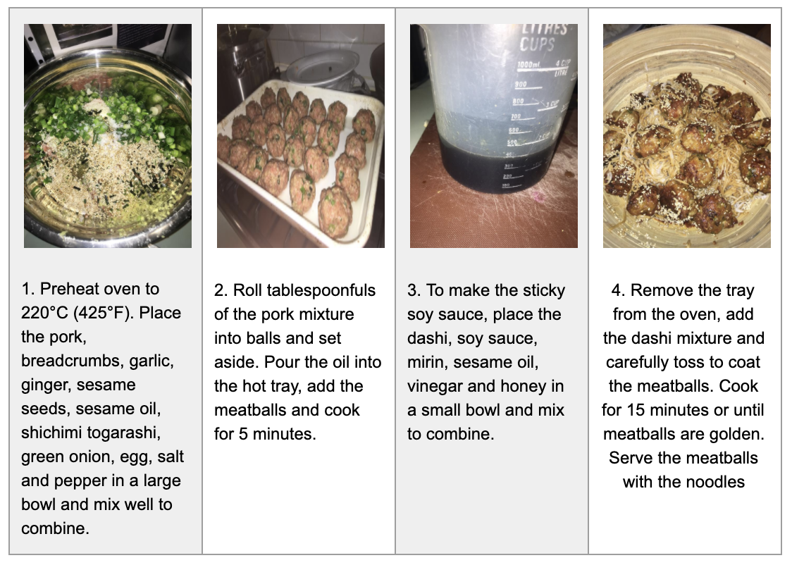

<html>
  <body>
<h2> Welcome to Visual Narrative Telling</h2>

This page corresponds to details on the sub-part of a bigger initiative. In specific, we are going to look into visual procedures. 

<h3> Why is Visual Procedure Telling important?</h3>

<h3> The various domains in our dataset along with their topic visualizations</h3>
1. <a href="lda_recipes_20.html" target="_blank">Recipes</a> 
2. <a href="lda_crafts_20.html" target="_blank">Arts and Crafts</a> 
3. <a href="lda_fitness_20.html" target="_blank">Fitness</a> 
4. <a href="lda_hobbies_20.html" target="_blank">Hobbies</a> 
5. <a href="lda_lifestyle_20.html" target="_blank">Lifestyle</a> 
6. <a href="lda_outdoors_20.html" target="_blank">Outdoors</a> 
7. <a href="lda_styling_20.html" target="_blank">Styling</a> 
8. <a href="lda_pets_20.html" target="_blank">Pets</a> 
9. <a href="lda_technology_20.html" target="_blank">Technology</a> 
10.<a href="lda_misc_20.html" target="_blank">Miscellaneous</a> 

<h3> Examples</h3>

Here is an example of making <b>Japanese Meatballs with Soba noodles</b>
  
 
Here is another example of <b>How to do a Squat</b>
 

This an an example on how to perform a simple <b> Card Trick </b>
 

<h3> Contact</h3>

Please reach out to us for the data at <a href="mailto:visual.narrative.telling@gmail.com"> <i>visual.narrative.telling@gmail.com</i></a>.  
</body>
</html>

